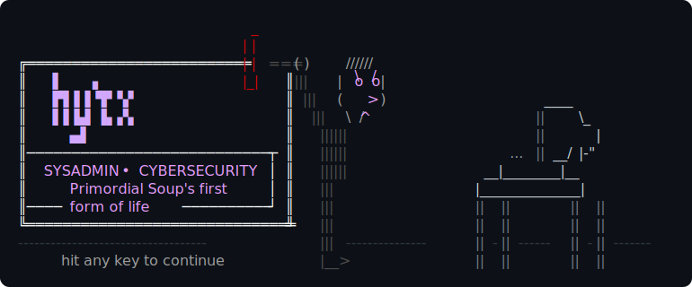

<!--
  ╔══════════════════════════════════════════════════════════════╗
  ║               ⚠ DO NOT EDIT THE DYNAMIC BLOCK ⚠            ║
  ║    The section between MOST_ACTIVE_REPOS markers is         ║
  ║    auto-generated by a GitHub Action. Manual edits          ║
  ║    will be overwritten.                                     ║
  ╚══════════════════════════════════════════════════════════════╝
-->

<!-- TYPING_SVG_START -->

  

<!-- TYPING_SVG_END -->
<!--
<pre align="center">
                           _
                          | |
╔═════════════════════════| |===( )  -\\\\
║   ▌   ▗                 |_|  ║|||  | o o|
║   ▛▌▌▌▜▘▚▘                   ║ ||| ( c  )                  ____
║   ▌▌▙▌▐▖▞▖                   ║  ||| \= /                  ||   \_
║     ▄▌                       ║   ||||||                   ||     |
║────────────────────────────┐ ║   ||||||                ...||__/|-"
║  SYSADMIN • CYBERSECURITY  │ ║   ||||||             __|________|__
║    Primordial Soup's first │ ║     |||             |______________|
║──── form of life ──────────┘ ║     |||             || ||      || ||
╚══════════════════════════════╝     |||             || ||      || ||
-------------------------------------|||-------------||-||------||-||-------
     hit any key to continue         |__>            || ||      || ||
</pre>
-->

  

---

  

